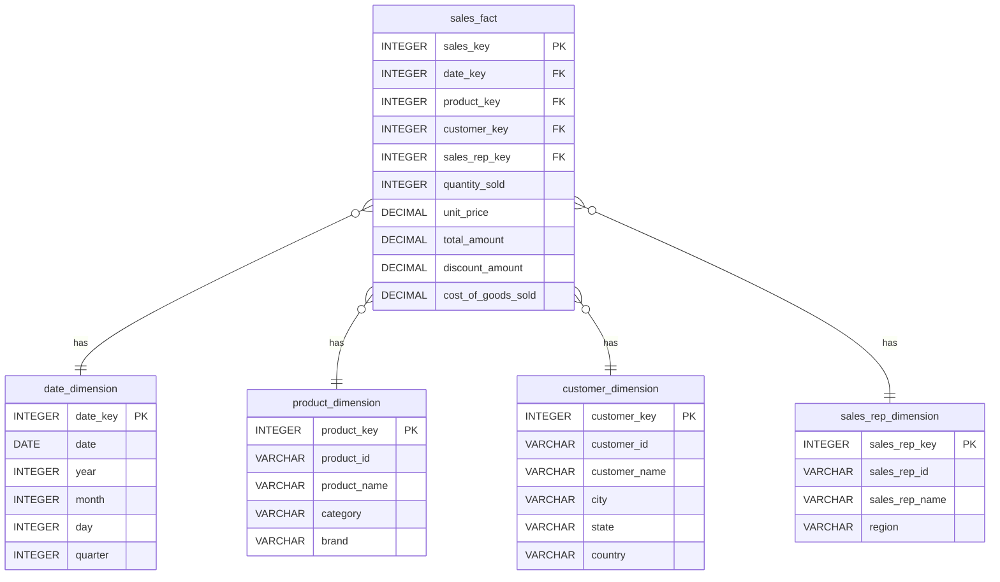
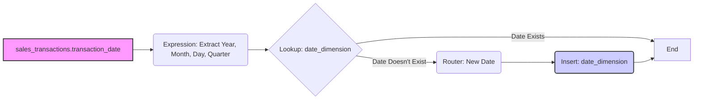
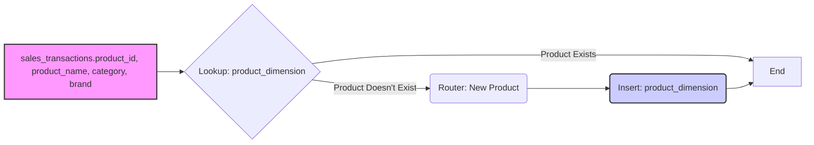
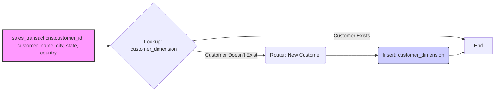
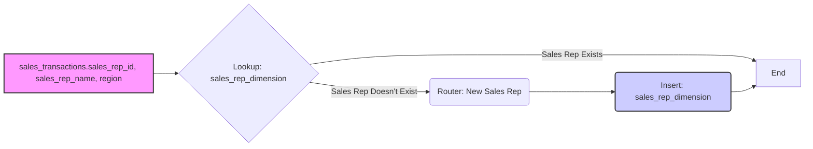
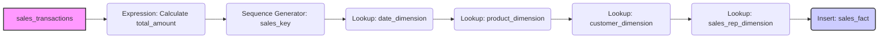
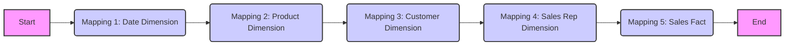

Okay, let's outline a complex Informatica IICS project for Sales Analytics using PostgreSQL as both source and target. This will be a multi-step process, starting with requirements, then data modeling, DDL, diagrams, pseudocode, and finally, a breakdown of the IICS mapping and workflow.  This is a substantial undertaking, so we'll focus on a core set of functionalities.

**Phase 1: Requirements & Scope**

*   **Business Goal:** Provide sales analytics to identify trends, improve forecasting, and optimize sales strategies.
*   **Data Sources:** PostgreSQL database containing sales transactions, customer information, product details, and potentially marketing campaign data.
*   **Target:** PostgreSQL data warehouse optimized for analytical queries.
*   **Key Analytics:**
    *   Sales by Region/Product/Time Period
    *   Customer Lifetime Value (CLTV)
    *   Sales Representative Performance
    *   Product Performance (Sales, Margin)
    *   Sales Forecast (Basic Time Series)
*   **Data Volume:** Assume moderate volume (e.g., 1 million sales transactions per month, 100k customers, 10k products).  Scalability should be considered in the design.
*   **Frequency:** Daily/Weekly data loads.
*   **Data Quality:**  Basic data cleansing and validation are required.

**Phase 2: Data Modeling (Star Schema)**

We'll use a star schema for the data warehouse.

*   **Fact Table:** `sales_fact`
    *   `sales_key` (Surrogate Key, Primary Key)
    *   `date_key` (Foreign Key to `date_dimension`)
    *   `product_key` (Foreign Key to `product_dimension`)
    *   `customer_key` (Foreign Key to `customer_dimension`)
    *   `sales_rep_key` (Foreign Key to `sales_rep_dimension`)
    *   `quantity_sold`
    *   `unit_price`
    *   `total_amount`
    *   `discount_amount`
    *   `cost_of_goods_sold`
*   **Dimension Tables:**
    *   `date_dimension`: `date_key`, `date`, `year`, `month`, `day`, `quarter`
    *   `product_dimension`: `product_key`, `product_id`, `product_name`, `category`, `brand`
    *   `customer_dimension`: `customer_key`, `customer_id`, `customer_name`, `city`, `state`, `country`
    *   `sales_rep_dimension`: `sales_rep_key`, `sales_rep_id`, `sales_rep_name`, `region`

**Phase 3: DDL (PostgreSQL)**

```sql
-- Date Dimension
CREATE TABLE date_dimension (
    date_key INTEGER PRIMARY KEY,
    date DATE NOT NULL,
    year INTEGER NOT NULL,
    month INTEGER NOT NULL,
    day INTEGER NOT NULL,
    quarter INTEGER NOT NULL
);

-- Product Dimension
CREATE TABLE product_dimension (
    product_key INTEGER PRIMARY KEY,
    product_id VARCHAR(255) NOT NULL,
    product_name VARCHAR(255) NOT NULL,
    category VARCHAR(255),
    brand VARCHAR(255)
);

-- Customer Dimension
CREATE TABLE customer_dimension (
    customer_key INTEGER PRIMARY KEY,
    customer_id VARCHAR(255) NOT NULL,
    customer_name VARCHAR(255) NOT NULL,
    city VARCHAR(255),
    state VARCHAR(255),
    country VARCHAR(255)
);

-- Sales Rep Dimension
CREATE TABLE sales_rep_dimension (
    sales_rep_key INTEGER PRIMARY KEY,
    sales_rep_id VARCHAR(255) NOT NULL,
    sales_rep_name VARCHAR(255) NOT NULL,
    region VARCHAR(255)
);

-- Sales Fact Table
CREATE TABLE sales_fact (
    sales_key INTEGER PRIMARY KEY,
    date_key INTEGER REFERENCES date_dimension(date_key),
    product_key INTEGER REFERENCES product_dimension(product_key),
    customer_key INTEGER REFERENCES customer_dimension(customer_key),
    sales_rep_key INTEGER REFERENCES sales_rep_dimension(sales_rep_key),
    quantity_sold INTEGER NOT NULL,
    unit_price DECIMAL(10, 2) NOT NULL,
    total_amount DECIMAL(10, 2) NOT NULL,
    discount_amount DECIMAL(10, 2),
    cost_of_goods_sold DECIMAL(10, 2)
);
```

**Phase 4:  Diagram (Mermaid)**



**Phase 5: Pseudocode (ETL Logic)**

This outlines the core transformations.

1.  **Extract from Source (PostgreSQL - Sales Transactions):**
    *   Connect to the source PostgreSQL database.
    *   Query the sales transactions table (e.g., `sales_transactions`).
    *   Extract relevant fields: `transaction_id`, `transaction_date`, `product_id`, `customer_id`, `sales_rep_id`, `quantity`, `price`, `discount`, `cost`.

2.  **Transformations:**
    *   **Date Dimension:**
        *   Extract the date from the transaction.
        *   Lookup or insert into `date_dimension` (handle missing dates).
        *   Get `date_key`.
    *   **Product Dimension:**
        *   Lookup or insert into `product_dimension` (handle new products).
        *   Get `product_key`.
    *   **Customer Dimension:**
        *   Lookup or insert into `customer_dimension` (handle new customers).
        *   Get `customer_key`.
    *   **Sales Rep Dimension:**
        *   Lookup or insert into `sales_rep_dimension` (handle new sales reps).
        *   Get `sales_rep_key`.
    *   **Sales Fact:**
        *   Calculate `total_amount` = `quantity` \* `price` - `discount`.
        *   Create `sales_key` (surrogate key generation).
        *   Populate `sales_fact` with the transformed data.

3.  **Load into Target (PostgreSQL - Data Warehouse):**
    *   Connect to the target PostgreSQL data warehouse.
    *   Insert data into `sales_fact`, `date_dimension`, `product_dimension`, `customer_dimension`, and `sales_rep_dimension`.

**Phase 6: Informatica IICS Implementation Breakdown**

1.  **Connections:**
    *   Create two PostgreSQL connections in IICS: one for the source and one for the target.  Test connectivity.

2.  **Source Definition:**
    *   Create a Source Definition based on the `sales_transactions` table.  Define the schema.

3.  **Target Definitions:**
    *   Create Target Definitions for each of the dimension and fact tables.  Define the schema.  Configure the loading method (e.g., Insert, Update, Upsert).

4.  **Mappings (Multiple Mappings for Modularity):**
    *   **Mapping 1: Date Dimension:**
        *   Source: `sales_transactions.transaction_date`
        *   Transformation:  Date/Time functions to extract year, month, day, quarter.
        *   Target: `date_dimension` (Lookup or Insert).  Use a Lookup transformation to check if the date already exists.  If not, use a Router transformation to send the new date to an Insert transformation.
    *   **Mapping 2: Product Dimension:**
        *   Source: `sales_transactions.product_id`, `sales_transactions.product_name`, `sales_transactions.category`, `sales_transactions.brand`
        *   Transformation: Lookup/Insert into `product_dimension`.
        *   Target: `product_dimension`.
    *   **Mapping 3: Customer Dimension:**
        *   Source: `sales_transactions.customer_id`, `sales_transactions.customer_name`, `sales_transactions.city`, `sales_transactions.state`, `sales_transactions.country`
        *   Transformation: Lookup/Insert into `customer_dimension`.
        *   Target: `customer_dimension`.
    *   **Mapping 4: Sales Rep Dimension:**
        *   Source: `sales_transactions.sales_rep_id`, `sales_transactions.sales_rep_name`, `sales_transactions.region`
        *   Transformation: Lookup/Insert into `sales_rep_dimension`.
        *   Target: `sales_rep_dimension`.
    *   **Mapping 5: Sales Fact:**
        *   Sources:  `sales_transactions` (all relevant fields), `date_key` (from Date Dimension Mapping), `product_key` (from Product Dimension Mapping), `customer_key` (from Customer Dimension Mapping), `sales_rep_key` (from Sales Rep Dimension Mapping).
        *   Transformations:  Calculations for `total_amount`, surrogate key generation (using a Sequence Generator transformation).
        *   Target: `sales_fact`.

5.  **Workflow:**
    *   Create a workflow in IICS.
    *   Add tasks for each of the mappings (Date, Product, Customer, Sales Rep, Sales Fact).
    *   Define the execution order:
        1.  Date Dimension Mapping
        2.  Product Dimension Mapping
        3.  Customer Dimension Mapping
        4.  Sales Rep Dimension Mapping
        5.  Sales Fact Mapping
    *   Configure error handling and logging.
    *   Schedule the workflow to run daily or weekly.

**Important Considerations:**

*   **Surrogate Key Generation:** Use a Sequence Generator transformation in IICS to generate unique surrogate keys for the dimension and fact tables.
*   **Slowly Changing Dimensions (SCD):**  Consider how to handle changes to dimension attributes (e.g., customer address changes).  Implement SCD Type 1, Type 2, or Type 3 as appropriate.
*   **Data Quality:** Implement data quality checks (e.g., null value handling, data type validation) in the mappings.
*   **Performance Tuning:**  Optimize the IICS mappings and workflow for performance.  Consider using partitioning and indexing in the target PostgreSQL database.
*   **Monitoring:**  Monitor the IICS workflow for errors and performance issues.

This detailed outline provides a solid foundation for building your Informatica IICS project.  Remember to test thoroughly at each stage of development.  Let me know if you'd like me to elaborate on any specific aspect of this project.  For example, we could dive deeper into SCD implementation or performance tuning techniques.


## Deep Dive into Source Data DDL & Sample Inserts (PostgreSQL)

We'll focus on the `sales_transactions` table, as it's the primary source for our data warehouse.  This section will cover a detailed DDL, considerations for data types, constraints, and indexing, followed by sample SQL insert statements.

**1. Detailed DDL for `sales_transactions`**

```sql
CREATE TABLE sales_transactions (
    transaction_id VARCHAR(255) PRIMARY KEY,  -- Unique identifier for each transaction
    transaction_date TIMESTAMP WITHOUT TIME ZONE NOT NULL, -- Date and time of the transaction
    product_id VARCHAR(255) NOT NULL, -- Foreign key to product table
    customer_id VARCHAR(255) NOT NULL, -- Foreign key to customer table
    sales_rep_id VARCHAR(255), -- Foreign key to sales representative table (can be NULL if not assigned)
    quantity INTEGER NOT NULL CHECK (quantity > 0), -- Quantity of product sold (must be positive)
    unit_price DECIMAL(10, 2) NOT NULL CHECK (unit_price >= 0), -- Price per unit (must be non-negative)
    discount_amount DECIMAL(10, 2) DEFAULT 0.00 CHECK (discount_amount >= 0), -- Discount applied to the transaction
    cost_of_goods_sold DECIMAL(10, 2) NOT NULL CHECK (cost_of_goods_sold >= 0), -- Cost of the goods sold
    payment_method VARCHAR(50), -- Method of payment (e.g., Credit Card, Cash, etc.)
    shipping_address TEXT, -- Shipping address for the transaction
    transaction_status VARCHAR(50) DEFAULT 'Completed', -- Status of the transaction (e.g., Completed, Pending, Cancelled)
    created_at TIMESTAMP WITHOUT TIME ZONE DEFAULT NOW(), -- Timestamp when the record was created
    updated_at TIMESTAMP WITHOUT TIME ZONE DEFAULT NOW() -- Timestamp when the record was last updated
);

-- Add indexes for performance
CREATE INDEX idx_sales_transactions_product_id ON sales_transactions (product_id);
CREATE INDEX idx_sales_transactions_customer_id ON sales_transactions (customer_id);
CREATE INDEX idx_sales_transactions_sales_rep_id ON sales_transactions (sales_rep_id);
CREATE INDEX idx_sales_transactions_transaction_date ON sales_transactions (transaction_date);
```

**Explanation of DDL Choices:**

*   **`transaction_id VARCHAR(255) PRIMARY KEY`:**  Using a `VARCHAR` for the transaction ID allows for flexibility in ID formats (e.g., alphanumeric IDs).  The `PRIMARY KEY` constraint ensures uniqueness.
*   **`transaction_date TIMESTAMP WITHOUT TIME ZONE`:**  `TIMESTAMP` stores both date and time.  `WITHOUT TIME ZONE` is generally preferred if you're handling dates in a single timezone.  If you need to handle multiple timezones, use `TIMESTAMP WITH TIME ZONE`.
*   **`product_id`, `customer_id`, `sales_rep_id VARCHAR(255) NOT NULL`:**  These are foreign keys referencing the dimension tables.  `NOT NULL` enforces referential integrity (assuming the dimensions always exist).
*   **`quantity INTEGER NOT NULL CHECK (quantity > 0)`:**  `INTEGER` is suitable for whole number quantities.  The `CHECK` constraint ensures that the quantity is always positive.
*   **`unit_price DECIMAL(10, 2) NOT NULL CHECK (unit_price >= 0)`:**  `DECIMAL(10, 2)` is ideal for monetary values, providing precision and avoiding floating-point errors.  The `CHECK` constraint ensures a non-negative price.
*   **`discount_amount DECIMAL(10, 2) DEFAULT 0.00 CHECK (discount_amount >= 0)`:**  `DEFAULT 0.00` provides a default value if no discount is specified.
*   **`cost_of_goods_sold DECIMAL(10, 2) NOT NULL CHECK (cost_of_goods_sold >= 0)`:**  Important for calculating profit margins.
*   **`payment_method VARCHAR(50)`:**  Stores the payment method used for the transaction.
*   **`shipping_address TEXT`:**  `TEXT` is suitable for storing potentially long shipping addresses.
*   **`transaction_status VARCHAR(50) DEFAULT 'Completed'`:**  Tracks the status of the transaction.
*   **`created_at TIMESTAMP WITHOUT TIME ZONE DEFAULT NOW()` & `updated_at TIMESTAMP WITHOUT TIME ZONE DEFAULT NOW()`:**  Useful for auditing and tracking changes.  `DEFAULT NOW()` automatically sets the creation timestamp.  You'll need a trigger to update `updated_at` on record updates.
*   **Indexes:**  Indexes on frequently queried columns (e.g., `product_id`, `customer_id`, `transaction_date`) significantly improve query performance.

**2. Sample SQL Insert Statements**

```sql
-- Insert a sample transaction
INSERT INTO sales_transactions (transaction_id, transaction_date, product_id, customer_id, sales_rep_id, quantity, unit_price, discount_amount, cost_of_goods_sold, payment_method, shipping_address)
VALUES (
    'TXN-20240126-001',
    '2024-01-26 10:30:00',
    'PROD-101',
    'CUST-001',
    'REP-001',
    2,
    25.00,
    5.00,
    15.00,
    'Credit Card',
    '123 Main St, Anytown, CA 91234'
);

-- Insert another transaction with a different payment method and no discount
INSERT INTO sales_transactions (transaction_id, transaction_date, product_id, customer_id, sales_rep_id, quantity, unit_price, cost_of_goods_sold, payment_method)
VALUES (
    'TXN-20240126-002',
    '2024-01-26 14:45:00',
    'PROD-102',
    'CUST-002',
    'REP-002',
    1,
    50.00,
    25.00,
    'Cash'
);

-- Insert a transaction with a NULL sales_rep_id (no sales rep assigned)
INSERT INTO sales_transactions (transaction_id, transaction_date, product_id, customer_id, quantity, unit_price, cost_of_goods_sold)
VALUES (
    'TXN-20240126-003',
    '2024-01-26 16:00:00',
    'PROD-101',
    'CUST-003',
    3,
    25.00,
    15.00
);
```

**Important Considerations for Source Data:**

*   **Data Types:**  Choose data types carefully to ensure data integrity and efficiency.
*   **Constraints:**  Use constraints (e.g., `NOT NULL`, `CHECK`, `PRIMARY KEY`, `FOREIGN KEY`) to enforce data quality and relationships.
*   **Indexing:**  Create indexes on frequently queried columns to improve performance.
*   **Data Volume:**  Consider the expected data volume and choose appropriate data types and indexing strategies.
*   **Data Quality:**  Implement data quality checks in the source system to prevent bad data from entering the data warehouse.
*   **Change Data Capture (CDC):**  For real-time or near-real-time data loading, consider implementing CDC to capture changes in the source system.  This is beyond the scope of this initial design but is important for scalability.


This detailed explanation should give you a strong understanding of the source data DDL and how to populate the `sales_transactions` table with sample data.  Remember to adapt the DDL and insert statements to your specific requirements.


Okay, let's create the Mermaid diagrams for each of the core transformations outlined in Phase 6.  I'll focus on visually representing the data flow and key transformations within each IICS mapping.  I'll use a consistent style for clarity.

**Key:**

*   **Rectangles:** Represent transformations (e.g., Lookup, Router, Expression).
*   **Parallelograms:** Represent data sources and targets.
*   **Arrows:** Indicate data flow.
*   **Text within shapes:** Describes the transformation or data source/target.

---

**1. Mapping 1: Date Dimension**



**Explanation:**

*   The `transaction_date` from `sales_transactions` is the input.
*   An Expression transformation extracts the year, month, day, and quarter.
*   A Lookup transformation checks if the date already exists in `date_dimension`.
*   If the date exists, the process ends.
*   If the date doesn't exist, a Router transformation directs the new date to an Insert transformation, which adds it to `date_dimension`.

---

**2. Mapping 2: Product Dimension**



**Explanation:**

*   Product information from `sales_transactions` is the input.
*   A Lookup transformation checks if the product already exists in `product_dimension`.
*   If the product exists, the process ends.
*   If the product doesn't exist, a Router transformation directs the new product information to an Insert transformation, which adds it to `product_dimension`.

---

**3. Mapping 3: Customer Dimension**



**Explanation:**

*   Customer information from `sales_transactions` is the input.
*   A Lookup transformation checks if the customer already exists in `customer_dimension`.
*   If the customer exists, the process ends.
*   If the customer doesn't exist, a Router transformation directs the new customer information to an Insert transformation, which adds it to `customer_dimension`.

---

**4. Mapping 4: Sales Rep Dimension**



**Explanation:**

*   Sales rep information from `sales_transactions` is the input.
*   A Lookup transformation checks if the sales rep already exists in `sales_rep_dimension`.
*   If the sales rep exists, the process ends.
*   If the sales rep doesn't exist, a Router transformation directs the new sales rep information to an Insert transformation, which adds it to `sales_rep_dimension`.

---

**5. Mapping 5: Sales Fact**



**Explanation:**

*   `sales_transactions` is the input.
*   An Expression transformation calculates `total_amount`.
*   A Sequence Generator transformation generates a unique `sales_key`.
*   Lookup transformations retrieve the `date_key`, `product_key`, `customer_key`, and `sales_rep_key` from the respective dimension tables.
*   An Insert transformation adds the transformed data to `sales_fact`.

---

**Important Notes:**

*   These diagrams are simplified representations.  Real-world mappings may have more complex transformations and error handling.
*   The specific transformations and their order may vary depending on your requirements and data quality.
*   The `End` nodes represent the successful completion of the mapping.  Error handling would typically be added to these diagrams to show how errors are handled.
*   The color coding is for visual clarity.  You can adjust it as needed.

These Mermaid diagrams provide a clear visual overview of the data flow and transformations within each IICS mapping.  They are a valuable tool for documenting and communicating your ETL process.  Let me know if you'd like me to refine any of these diagrams or add more detail.


Okay, here's a Mermaid diagram representing the overall workflow in Informatica IICS, outlining the execution order of the mappings we've defined.  This taskflow diagram shows the dependencies between the mappings and the overall flow of data.



**Explanation:**

*   **Start:** Represents the beginning of the workflow.
*   **Mapping 1: Date Dimension:** The first mapping to run, populating the `date_dimension` table.
*   **Mapping 2: Product Dimension:** Runs after the Date Dimension mapping, populating the `product_dimension` table.
*   **Mapping 3: Customer Dimension:** Runs after the Product Dimension mapping, populating the `customer_dimension` table.
*   **Mapping 4: Sales Rep Dimension:** Runs after the Customer Dimension mapping, populating the `sales_rep_dimension` table.
*   **Mapping 5: Sales Fact:** The final mapping to run, populating the `sales_fact` table.  It depends on the successful completion of all the dimension mappings.
*   **End:** Represents the successful completion of the workflow.

**Key Considerations for the IICS Workflow:**

*   **Dependencies:** The workflow is designed with dependencies to ensure that the dimension tables are populated before the fact table.  This is crucial for referential integrity.
*   **Error Handling:** In a real-world workflow, you would add error handling tasks to catch and handle errors that occur during the mappings.  This could include logging errors, sending notifications, or retrying failed tasks.
*   **Scheduling:** The workflow would be scheduled to run daily or weekly, depending on your data loading frequency.
*   **Parallelism:**  Depending on the IICS environment and data volume, you might consider running some of the dimension mappings in parallel to improve performance.  However, be careful to avoid resource contention.
*   **Workflow Variables:**  You can use workflow variables to pass data between tasks or to control the behavior of the workflow.
*   **Monitoring:**  Regularly monitor the workflow to ensure that it is running successfully and to identify any performance issues.


This taskflow diagram provides a high-level overview of the IICS workflow.  It's a valuable tool for visualizing the overall process and ensuring that the mappings are executed in the correct order.  Let me know if you'd like me to add more detail to this diagram, such as error handling tasks or parallelism.


Okay, let's create the Mermaid diagrams for each of the core transformations outlined in Phase 6.  I'll focus on visually representing the data flow and key transformations within each IICS mapping.  I'll use a consistent style for clarity.

**Key:**

*   **Rectangles:** Represent transformations (e.g., Lookup, Router, Expression).
*   **Parallelograms:** Represent data sources and targets.
*   **Arrows:** Indicate data flow.
*   **Text within shapes:** Describes the transformation or data source/target.

---

**1. Mapping 1: Date Dimension**


**Explanation:**

*   The `transaction_date` from `sales_transactions` is the input.
*   An Expression transformation extracts the year, month, day, and quarter.
*   A Lookup transformation checks if the date already exists in `date_dimension`.
*   If the date exists, the process ends.
*   If the date doesn't exist, a Router transformation directs the new date to an Insert transformation, which adds it to `date_dimension`.

---

**2. Mapping 2: Product Dimension**


**Explanation:**

*   Product information from `sales_transactions` is the input.
*   A Lookup transformation checks if the product already exists in `product_dimension`.
*   If the product exists, the process ends.
*   If the product doesn't exist, a Router transformation directs the new product information to an Insert transformation, which adds it to `product_dimension`.

---

**3. Mapping 3: Customer Dimension**


**Explanation:**

*   Customer information from `sales_transactions` is the input.
*   A Lookup transformation checks if the customer already exists in `customer_dimension`.
*   If the customer exists, the process ends.
*   If the customer doesn't exist, a Router transformation directs the new customer information to an Insert transformation, which adds it to `customer_dimension`.

---

**4. Mapping 4: Sales Rep Dimension**


**Explanation:**

*   Sales rep information from `sales_transactions` is the input.
*   A Lookup transformation checks if the sales rep already exists in `sales_rep_dimension`.
*   If the sales rep exists, the process ends.
*   If the sales rep doesn't exist, a Router transformation directs the new sales rep information to an Insert transformation, which adds it to `sales_rep_dimension`.

---

**5. Mapping 5: Sales Fact**


**Explanation:**

*   `sales_transactions` is the input.
*   An Expression transformation calculates `total_amount`.
*   A Sequence Generator transformation generates a unique `sales_key`.
*   Lookup transformations retrieve the `date_key`, `product_key`, `customer_key`, and `sales_rep_key` from the respective dimension tables.
*   An Insert transformation adds the transformed data to `sales_fact`.

---

**Important Notes:**

*   These diagrams are simplified representations.  Real-world mappings may have more complex transformations and error handling.
*   The specific transformations and their order may vary depending on your requirements and data quality.
*   The `End` nodes represent the successful completion of the mapping.  Error handling would typically be added to these diagrams to show how errors are handled.
*   The color coding is for visual clarity.  You can adjust it as needed.

These Mermaid diagrams provide a clear visual overview of the data flow and transformations within each IICS mapping.  They are a valuable tool for documenting and communicating your ETL process.  Let me know if you'd like me to refine any of these diagrams or add more detail.